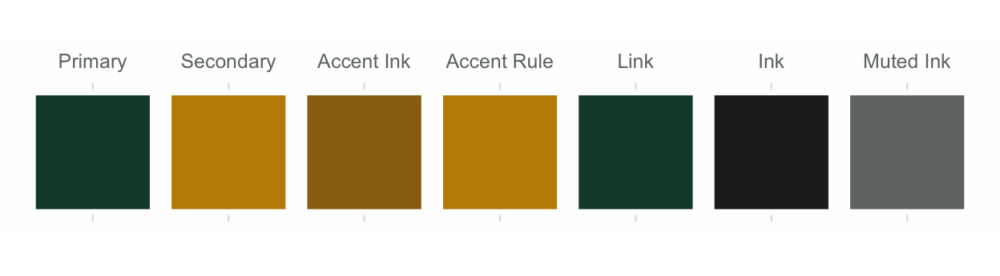
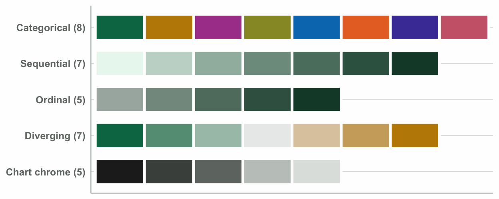
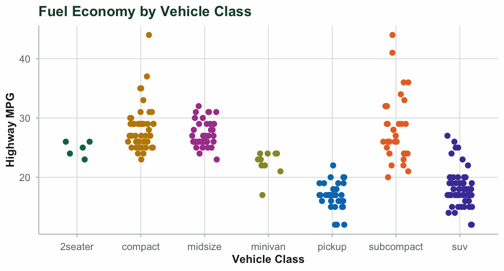
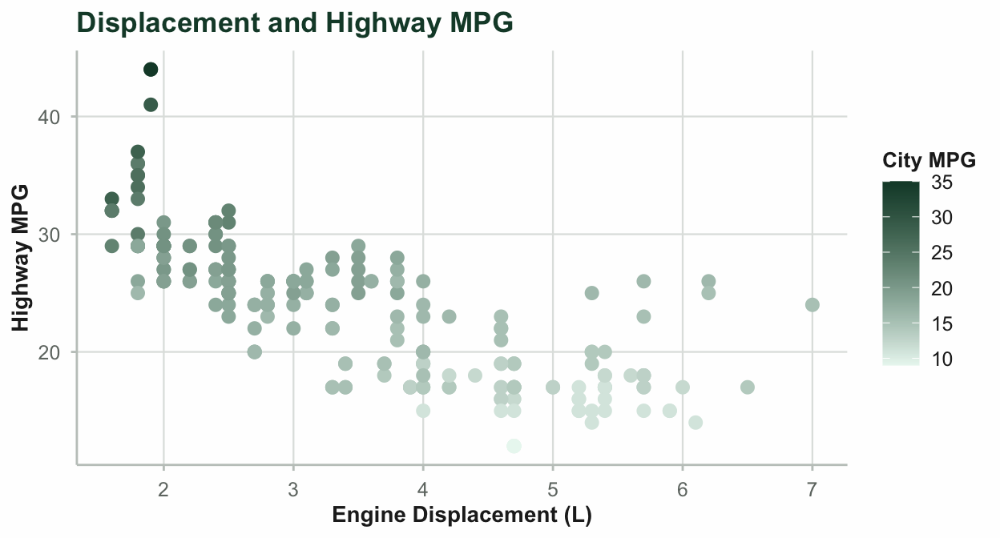
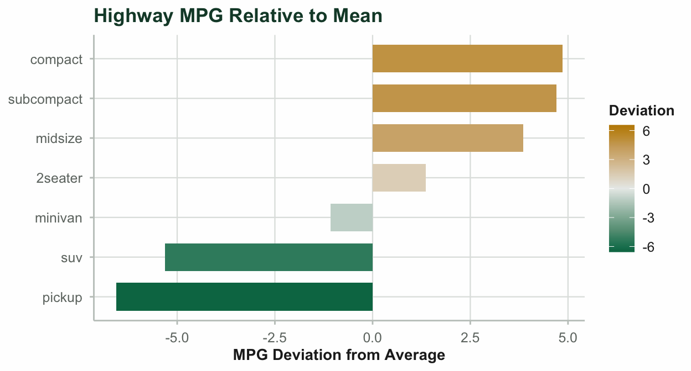
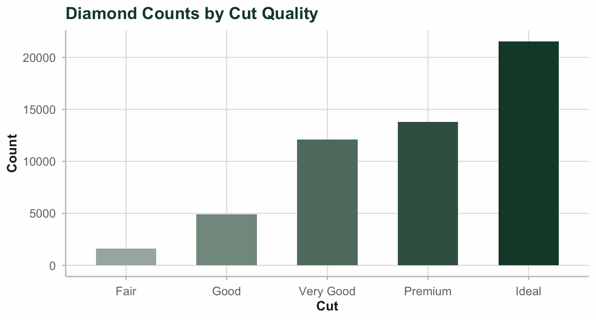
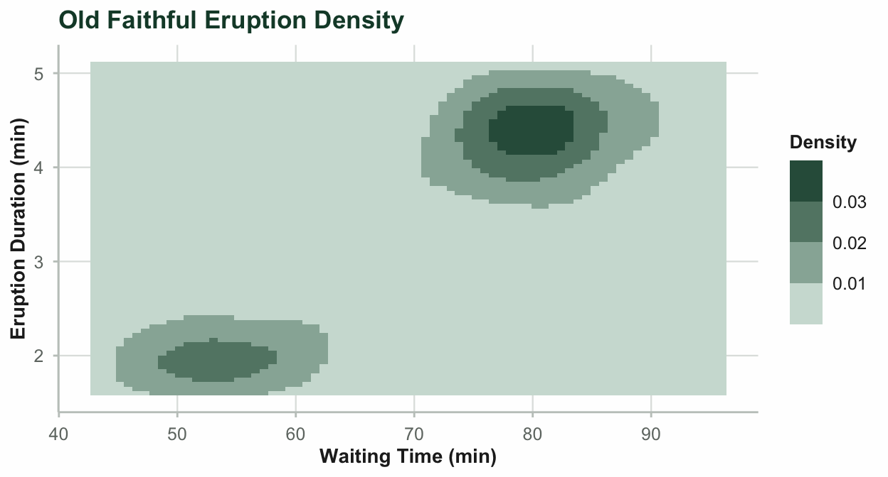

# Theming and Scales

`mariner` provides a Baylor theme and a palette system for `ggplot2`.

## 1. Brand Palette and Chrome

Brand colours separate into chrome roles and data series palettes.

- **Chrome roles**: Page background, headings, rules, and link text.
- **Data series**: Colors selected and tested for contrast against the
  background and distinction under color vision deficiencies.

Inspect available brand hex codes:

[`mariner_colors`](https://thomasqmd.github.io/mariner/reference/mariner_colors.md)`(``)`` ``#> background foreground baylor-green university-gold gold-ink `` ``#> "#fefefe" "#222222" "#154734" "#FFB81C" "#9b6e06" `` ``#> gold-rule series-1-green series-2-gold series-3-purple series-4-olive `` ``#> "#c28a01" "#017553" "#c08802" "#aa4499" "#979731" `` ``#> series-5-sky series-6-orange series-7-indigo series-8-rose seq-1 `` ``#> "#0178bc" "#e8712a" "#493fa6" "#cc6677" "#eaf7f1" `` ``#> seq-2 seq-3 seq-4 seq-5 seq-6 `` ``#> "#c5d7ce" "#a0b9ad" "#7d9b8c" "#5b7e6d" "#396250" `` ``#> seq-7 ord-1 ord-2 ord-3 ord-4 `` ``#> "#154734" "#a8b4ae" "#83988e" "#5f7c6e" "#3b6150" `` ``#> ord-5 div-1 div-2 div-3 div-4 `` ``#> "#154734" "#017553" "#649c83" "#a8c3b6" "#e9ecea" `` ``#> div-5 div-6 div-7 ink ink-secondary `` ``#> "#decaac" "#cfaa6b" "#c08802" "#222222" "#4a4f4b" `` ``#> ink-muted rule-grid rule-axis primary secondary `` ``#> "#6f7671" "#dfe3e0" "#c2c8c4" "#154734" "#c28a01" `` ``#> link accent-ink accent-rule on-primary on-secondary `` ``#> "#154734" "#9a6e13" "#c28a01" "#fefefe" "#222222" `` ``#> series-1 series-2 series-3 series-4 series-5 `` ``#> "#017553" "#c08802" "#aa4499" "#979731" "#0178bc" `` ``#> series-6 series-7 series-8 `` ``#> "#e8712a" "#493fa6" "#cc6677"`

### Brand Chrome Roles

`chrome_roles`` ``<-`` `[`c`](https://rdrr.io/r/base/c.html)`(``"primary"``, ``"secondary"``, ``"accent-ink"``, ``"accent-rule"``,`` `` ``"link"``, ``"ink"``, ``"ink-muted"``)`` ``chrome_labels`` ``<-`` `[`c`](https://rdrr.io/r/base/c.html)`(``"Primary"``, ``"Secondary"``, ``"Accent Ink"``, ``"Accent Rule"``,`` `` ``"Link"``, ``"Ink"``, ``"Muted Ink"``)`` `` ``chrome_df`` ``<-`` `[`data.frame`](https://rdrr.io/r/base/data.frame.html)`(`` `` Slot ``=`` `[`seq_along`](https://rdrr.io/r/base/seq.html)`(``chrome_roles``)``,`` `` Role ``=`` `[`factor`](https://rdrr.io/r/base/factor.html)`(``chrome_labels``, levels ``=`` ``chrome_labels``)``,`` `` Color ``=`` `[`unname`](https://rdrr.io/r/base/unname.html)`(`[`mariner_colors`](https://thomasqmd.github.io/mariner/reference/mariner_colors.md)`(``)``[``chrome_roles``]``)`` ``)`` `` `[`ggplot`](https://ggplot2.tidyverse.org/reference/ggplot.html)`(``chrome_df``, `[`aes`](https://ggplot2.tidyverse.org/reference/aes.html)`(``Slot``, ``1``, fill ``=`` ``Color``)``)`` ``+`` `` `[`geom_tile`](https://ggplot2.tidyverse.org/reference/geom_tile.html)`(``color ``=`` `[`mariner_colors`](https://thomasqmd.github.io/mariner/reference/mariner_colors.md)`(``)``[[``"background"``]``]``,`` `` linewidth ``=`` ``1.2``, width ``=`` ``0.88``, height ``=`` ``0.88``)`` ``+`` `` `[`scale_fill_identity`](https://ggplot2.tidyverse.org/reference/scale_identity.html)`(``)`` ``+`` `` `[`scale_x_continuous`](https://ggplot2.tidyverse.org/reference/scale_continuous.html)`(``breaks ``=`` ``chrome_df``$``Slot``, labels ``=`` ``chrome_df``$``Role``,`` `` position ``=`` ``"top"``, expand ``=`` `[`c`](https://rdrr.io/r/base/c.html)`(``0.02``, ``0.02``)``)`` ``+`` `` `[`scale_y_continuous`](https://ggplot2.tidyverse.org/reference/scale_continuous.html)`(``breaks ``=`` ``NULL``, expand ``=`` `[`c`](https://rdrr.io/r/base/c.html)`(``0.04``, ``0.04``)``)`` ``+`` `` `[`coord_fixed`](https://ggplot2.tidyverse.org/reference/coord_fixed.html)`(``)`` ``+`` `` `[`labs`](https://ggplot2.tidyverse.org/reference/labs.html)`(``x ``=`` ``NULL``, y ``=`` ``NULL``)`` ``+`` `` `[`theme_mariner`](https://thomasqmd.github.io/mariner/reference/theme_mariner.md)`(``)`` ``+`` `` `[`theme`](https://ggplot2.tidyverse.org/reference/theme.html)`(`` `` panel.grid ``=`` `[`element_blank`](https://ggplot2.tidyverse.org/reference/element.html)`(``)``,`` `` axis.line ``=`` `[`element_blank`](https://ggplot2.tidyverse.org/reference/element.html)`(``)``,`` `` axis.ticks ``=`` `[`element_blank`](https://ggplot2.tidyverse.org/reference/element.html)`(``)``,`` `` axis.text.y ``=`` `[`element_blank`](https://ggplot2.tidyverse.org/reference/element.html)`(``)`` `` ``)`

## 2. Palette Families

[`mariner_pal()`](https://thomasqmd.github.io/mariner/reference/mariner_pal.md)
generates palettes across five families:

1.  **Discrete (`"discrete"`)**: Categorical data up to 8 classes.
2.  **Sequential (`"sequential"`)**: Quantitative magnitude.
3.  **Ordinal (`"ordinal"`)**: Ordered factors.
4.  **Diverging (`"diverging"`)**: Values with a neutral midpoint.
5.  **Chart chrome**: Structural grid and axis rules.

`fams`` ``<-`` `[`list`](https://rdrr.io/r/base/list.html)`(`` `` ``"Categorical (8)"`` ``=`` `[`mariner_pal`](https://thomasqmd.github.io/mariner/reference/mariner_pal.md)`(``family ``=`` ``"discrete"``, n ``=`` ``8``)``,`` `` ``"Sequential (7)"`` ``=`` `[`mariner_pal`](https://thomasqmd.github.io/mariner/reference/mariner_pal.md)`(``family ``=`` ``"sequential"``, n ``=`` ``7``)``,`` `` ``"Ordinal (5)"`` ``=`` `[`mariner_pal`](https://thomasqmd.github.io/mariner/reference/mariner_pal.md)`(``family ``=`` ``"ordinal"``, n ``=`` ``5``)``,`` `` ``"Diverging (7)"`` ``=`` `[`mariner_pal`](https://thomasqmd.github.io/mariner/reference/mariner_pal.md)`(``family ``=`` ``"diverging"``, n ``=`` ``7``)``,`` `` ``"Chart chrome (5)"`` ``=`` `[`unname`](https://rdrr.io/r/base/unname.html)`(`[`mariner_colors`](https://thomasqmd.github.io/mariner/reference/mariner_colors.md)`(``)``[`` `` `[`c`](https://rdrr.io/r/base/c.html)`(``"ink"``, ``"ink-secondary"``, ``"ink-muted"``, ``"rule-axis"``, ``"rule-grid"``)``]``)`` ``)`` `` ``swatches`` ``<-`` `[`do.call`](https://rdrr.io/r/base/do.call.html)`(``rbind``, `[`lapply`](https://rdrr.io/r/base/lapply.html)`(`[`names`](https://rdrr.io/r/base/names.html)`(``fams``)``, ``function``(``f``)`` ``{`` `` `[`data.frame`](https://rdrr.io/r/base/data.frame.html)`(``Family ``=`` ``f``, Step ``=`` `[`seq_along`](https://rdrr.io/r/base/seq.html)`(``fams``[[``f``]``]``)``, Color ``=`` ``fams``[[``f``]``]``)`` ``}``)``)`` ``swatches``$``Family`` ``<-`` `[`factor`](https://rdrr.io/r/base/factor.html)`(``swatches``$``Family``, levels ``=`` `[`rev`](https://rdrr.io/r/base/rev.html)`(`[`names`](https://rdrr.io/r/base/names.html)`(``fams``)``)``)`` `` `[`ggplot`](https://ggplot2.tidyverse.org/reference/ggplot.html)`(``swatches``, `[`aes`](https://ggplot2.tidyverse.org/reference/aes.html)`(``Step``, ``Family``, fill ``=`` ``Color``)``)`` ``+`` `` `[`geom_tile`](https://ggplot2.tidyverse.org/reference/geom_tile.html)`(``color ``=`` `[`mariner_colors`](https://thomasqmd.github.io/mariner/reference/mariner_colors.md)`(``)``[[``"background"``]``]``,`` `` linewidth ``=`` ``1.2``, height ``=`` ``0.72``)`` ``+`` `` `[`scale_fill_identity`](https://ggplot2.tidyverse.org/reference/scale_identity.html)`(``)`` ``+`` `` `[`scale_x_continuous`](https://ggplot2.tidyverse.org/reference/scale_continuous.html)`(``breaks ``=`` ``NULL``, expand ``=`` `[`c`](https://rdrr.io/r/base/c.html)`(``0.01``, ``0.01``)``)`` ``+`` `` `[`labs`](https://ggplot2.tidyverse.org/reference/labs.html)`(``x ``=`` ``NULL``, y ``=`` ``NULL``)`` ``+`` `` `[`theme_mariner`](https://thomasqmd.github.io/mariner/reference/theme_mariner.md)`(``)`` ``+`` `` `[`theme`](https://ggplot2.tidyverse.org/reference/theme.html)`(`` `` panel.grid ``=`` `[`element_blank`](https://ggplot2.tidyverse.org/reference/element.html)`(``)``,`` `` axis.ticks ``=`` `[`element_blank`](https://ggplot2.tidyverse.org/reference/element.html)`(``)``,`` `` axis.text.x ``=`` `[`element_blank`](https://ggplot2.tidyverse.org/reference/element.html)`(``)``,`` `` axis.text.y ``=`` `[`element_text`](https://ggplot2.tidyverse.org/reference/element.html)`(``face ``=`` ``"bold"``)`` `` ``)`

## 3. Scale Functions

`mariner` exports scale functions for `colour` and `fill`.

### Discrete Scale: `scale_colour_mariner_d()`

[`ggplot`](https://ggplot2.tidyverse.org/reference/ggplot.html)`(``mpg``, `[`aes`](https://ggplot2.tidyverse.org/reference/aes.html)`(``class``, ``hwy``, color ``=`` ``class``)``)`` ``+`` `` `[`geom_jitter`](https://ggplot2.tidyverse.org/reference/geom_jitter.html)`(``width ``=`` ``0.2``, height ``=`` ``0``, size ``=`` ``2``)`` ``+`` `` `[`scale_colour_mariner_d`](https://thomasqmd.github.io/mariner/reference/scale_mariner_d.md)`(``)`` ``+`` `` `[`labs`](https://ggplot2.tidyverse.org/reference/labs.html)`(``title ``=`` ``"Fuel Economy by Vehicle Class"``,`` `` x ``=`` ``"Vehicle Class"``, y ``=`` ``"Highway MPG"``)`` ``+`` `` `[`theme_mariner`](https://thomasqmd.github.io/mariner/reference/theme_mariner.md)`(``)`` ``+`` `` `[`theme`](https://ggplot2.tidyverse.org/reference/theme.html)`(``legend.position ``=`` ``"none"``)`

### Continuous Scale: `scale_colour_mariner_c()`

[`ggplot`](https://ggplot2.tidyverse.org/reference/ggplot.html)`(``mpg``, `[`aes`](https://ggplot2.tidyverse.org/reference/aes.html)`(``displ``, ``hwy``, color ``=`` ``cty``)``)`` ``+`` `` `[`geom_point`](https://ggplot2.tidyverse.org/reference/geom_point.html)`(``size ``=`` ``2.5``)`` ``+`` `` `[`scale_colour_mariner_c`](https://thomasqmd.github.io/mariner/reference/scale_mariner_c.md)`(``)`` ``+`` `` `[`labs`](https://ggplot2.tidyverse.org/reference/labs.html)`(``title ``=`` ``"Displacement and Highway MPG"``,`` `` x ``=`` ``"Engine Displacement (L)"``, y ``=`` ``"Highway MPG"``, color ``=`` ``"City MPG"``)`` ``+`` `` `[`theme_mariner`](https://thomasqmd.github.io/mariner/reference/theme_mariner.md)`(``)`

### Diverging Scale: `scale_fill_mariner_div()`

Diverging scales center on zero or a reference value with symmetric
limits:

`class_mean`` ``<-`` `[`tapply`](https://rdrr.io/r/base/tapply.html)`(``mpg``$``hwy``, ``mpg``$``class``, ``mean``)`` ``class_deviation`` ``<-`` `[`data.frame`](https://rdrr.io/r/base/data.frame.html)`(`` `` class ``=`` `[`names`](https://rdrr.io/r/base/names.html)`(``class_mean``)``,`` `` deviation ``=`` `[`unname`](https://rdrr.io/r/base/unname.html)`(``class_mean``)`` ``-`` `[`mean`](https://rdrr.io/r/base/mean.html)`(``mpg``$``hwy``)`` ``)`` ``class_deviation`` ``<-`` ``class_deviation``[`[`order`](https://rdrr.io/r/base/order.html)`(``class_deviation``$``deviation``)``, ``]`` ``class_deviation``$``class`` ``<-`` `[`factor`](https://rdrr.io/r/base/factor.html)`(``class_deviation``$``class``, levels ``=`` ``class_deviation``$``class``)`` `` ``div_limit`` ``<-`` `[`max`](https://rdrr.io/r/base/Extremes.html)`(`[`abs`](https://rdrr.io/r/base/MathFun.html)`(``class_deviation``$``deviation``)``)`` ``*`` `[`c`](https://rdrr.io/r/base/c.html)`(``-``1``, ``1``)`` `` `[`ggplot`](https://ggplot2.tidyverse.org/reference/ggplot.html)`(``class_deviation``, `[`aes`](https://ggplot2.tidyverse.org/reference/aes.html)`(``class``, ``deviation``, fill ``=`` ``deviation``)``)`` ``+`` `` `[`geom_col`](https://ggplot2.tidyverse.org/reference/geom_bar.html)`(``width ``=`` ``0.7``)`` ``+`` `` `[`coord_flip`](https://ggplot2.tidyverse.org/reference/coord_flip.html)`(``)`` ``+`` `` `[`scale_fill_mariner_div`](https://thomasqmd.github.io/mariner/reference/scale_mariner_div.md)`(``limits ``=`` ``div_limit``)`` ``+`` `` `[`labs`](https://ggplot2.tidyverse.org/reference/labs.html)`(``title ``=`` ``"Highway MPG Relative to Mean"``,`` `` x ``=`` ``NULL``, y ``=`` ``"MPG Deviation from Average"``, fill ``=`` ``"Deviation"``)`` ``+`` `` `[`theme_mariner`](https://thomasqmd.github.io/mariner/reference/theme_mariner.md)`(``)`

### Ordinal Scale: `scale_fill_mariner_o()`

[`ggplot`](https://ggplot2.tidyverse.org/reference/ggplot.html)`(``diamonds``, `[`aes`](https://ggplot2.tidyverse.org/reference/aes.html)`(``x ``=`` ``cut``, fill ``=`` ``cut``)``)`` ``+`` `` `[`geom_bar`](https://ggplot2.tidyverse.org/reference/geom_bar.html)`(``width ``=`` ``0.6``)`` ``+`` `` `[`scale_fill_mariner_o`](https://thomasqmd.github.io/mariner/reference/scale_mariner_o.md)`(``)`` ``+`` `` `[`labs`](https://ggplot2.tidyverse.org/reference/labs.html)`(``title ``=`` ``"Diamond Counts by Cut Quality"``, x ``=`` ``"Cut"``, y ``=`` ``"Count"``)`` ``+`` `` `[`theme_mariner`](https://thomasqmd.github.io/mariner/reference/theme_mariner.md)`(``)`` ``+`` `` `[`theme`](https://ggplot2.tidyverse.org/reference/theme.html)`(``legend.position ``=`` ``"none"``)`

### Binned Scale: `scale_fill_mariner_b()`

[`ggplot`](https://ggplot2.tidyverse.org/reference/ggplot.html)`(``faithfuld``, `[`aes`](https://ggplot2.tidyverse.org/reference/aes.html)`(``waiting``, ``eruptions``, fill ``=`` ``density``)``)`` ``+`` `` `[`geom_tile`](https://ggplot2.tidyverse.org/reference/geom_tile.html)`(``)`` ``+`` `` `[`scale_fill_mariner_b`](https://thomasqmd.github.io/mariner/reference/scale_mariner_b.md)`(``)`` ``+`` `` `[`labs`](https://ggplot2.tidyverse.org/reference/labs.html)`(``title ``=`` ``"Old Faithful Eruption Density"``,`` `` x ``=`` ``"Waiting Time (min)"``, y ``=`` ``"Eruption Duration (min)"``, fill ``=`` ``"Density"``)`` ``+`` `` `[`theme_mariner`](https://thomasqmd.github.io/mariner/reference/theme_mariner.md)`(``)`

## 4. Knitr Chunk Configuration

In report `.qmd` setup chunks,
[`mariner_knitr_setup()`](https://thomasqmd.github.io/mariner/reference/mariner_knitr_setup.md)
initializes options and sets the ggplot2 theme:

[`mariner_knitr_setup`](https://thomasqmd.github.io/mariner/reference/mariner_knitr_setup.md)`(``"pdf"``)`
